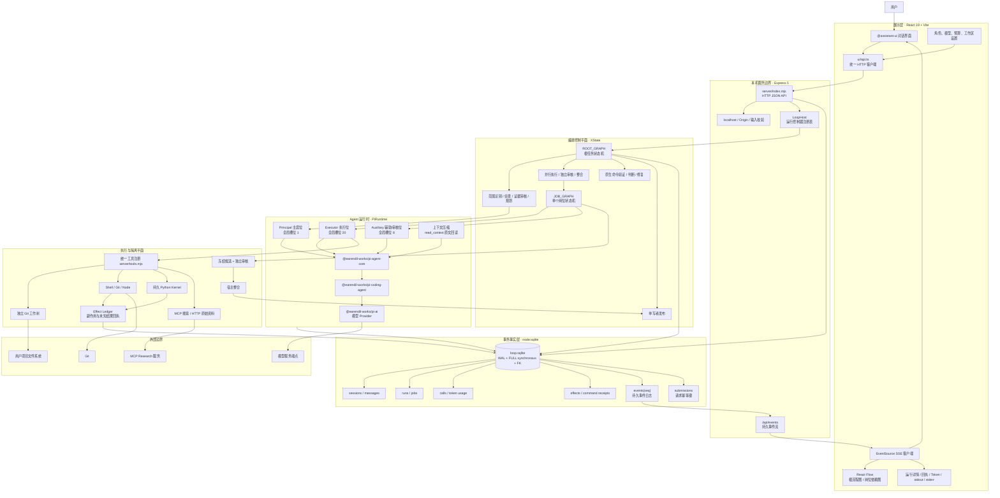
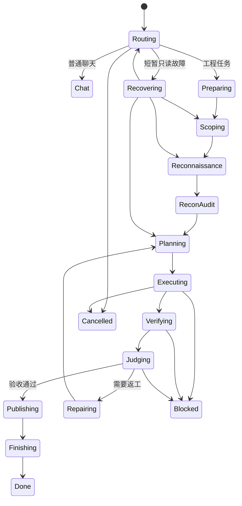
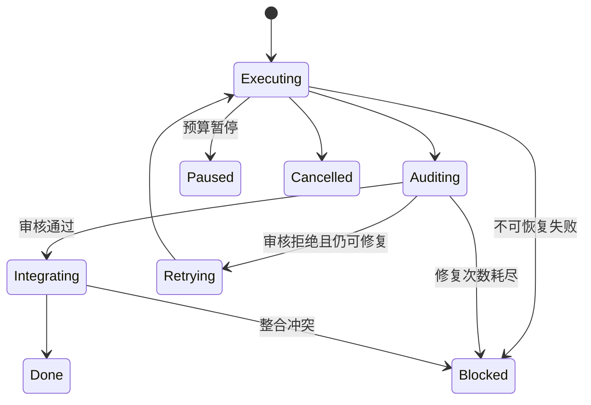
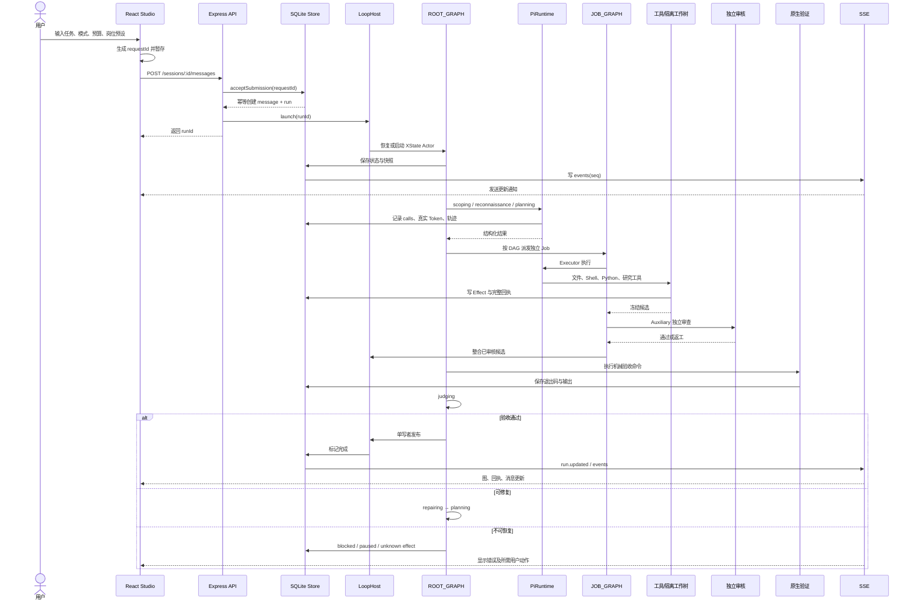

# `pi-loop-studio/orchestra`：完整架构与演进报告

本文是 `pi-loop-studio/orchestra` 的源码级技术架构说明，并与其前身 `pi-agent-loop` 比较。它关注真实组件边界、状态机、运行时序、持久化、副作用语义、隔离发布和机械验证，不是产品营销文案。

## 版本基线

- 新版与本文主体：`pi-loop-studio/orchestra`（源码目录 `pi-loop-studio`）
- 对照基线：`pi-agent-loop`

下面所有“新增、删除、增强、退化、保留”均表示 `pi-loop-studio/orchestra` 相对于 `pi-agent-loop` 的变化。

# 一句话总判断

`pi-loop-studio` 不是对旧版 Astra UI 的渐进升级，而是一次面向“可证明的并行 Agent 工作流”的重新建造：

> 旧版 `pi-agent-loop` 是功能丰富的 Pi Agent 桌面/Web 工作台；新版 `pi-loop-studio` 则把核心收敛成“轻量本地 Studio UI + HTTP/SSE 服务 + XState 双层工作流 + Pi 多角色运行时 + SQLite 事务事实库 + 隔离工作树与单写者发布”。

新版的主要价值不是页面更多，而是把“侦查—规划—并行执行—独立审核—机械验证—修复—发布”变成了显式、持久、可恢复、可审计的系统状态机。

---

# 一、新版完整架构图



这里最容易误画的一点是：新版并不是一个独立实现所有 Agent 能力的孤立程序。它的 Agent、模型协议和编码工具仍深度依赖 Pi 生态包，Studio 自己主要负责工作流、可靠性、隔离、持久化、展示和发布控制。这个依赖关系可从 [package.json](../package.json#L12) 看到。

---

# 二、逐层解释新版架构

## 1. 展示层：从“综合桌面工作台”收敛成“LOOP 控制台”

新版前端是 React 19 + Vite SPA，不再使用旧版的 Next.js App Router。

核心组成：

- [ui/main.tsx](../ui/main.tsx#L6) 挂载整个 React 应用。
- [ui/App.tsx](../ui/App.tsx#L19) 用 `useExternalStoreRuntime` 把服务端会话映射给 `@assistant-ui/react`。
- [ui/Graph.tsx](../ui/Graph.tsx#L29) 使用 React Flow 展示两张真实运行图：
  - 根流程图；
  - 岗位依赖图。
- [ui/api.ts](../ui/api.ts#L8) 是统一的 JSON API 客户端。
- [ui/App.tsx](../ui/App.tsx#L84) 使用 `EventSource` 连接 `/api/events`。
- [ui/App.tsx](../ui/App.tsx#L57) 展示模型调用、Token、命令、退出码、stdout、stderr、未知副作用等回执。

前端不是系统事实源。它只是：

1. 发出命令；
2. 获取 SQLite 中已经物化的状态；
3. 通过 SSE 获知“状态可能变化”；
4. 重新读取会话、运行、事件和回执。

这是一个重要的架构选择：即使浏览器刷新、UI 崩溃或 SSE 断线，任务的权威状态仍在后端数据库和 XState 快照中。

前端只在 `localStorage` 保存很少的客户端状态，例如选中的会话和尚未确认响应的发送请求，见 [ui/App.tsx](../ui/App.tsx#L92) 和 [ui/App.tsx](../ui/App.tsx#L107)。

---

## 2. 本机 API 层：轻量 Express，而不是 Next.js 全栈运行时

新版后端入口是 [server/index.mjs](../server/index.mjs#L15)。

它承担五类职责：

### 会话接口

- 获取会话列表；
- 创建会话；
- 获取会话、消息和运行历史；
- 修改标题或工作区。

相关路由从 [server/index.mjs](../server/index.mjs#L46) 开始。

### 任务运行接口

- 发送消息并创建 Run；
- 查看 Run 详情；
- 获取 Run 的分页事件；
- 导出完整运行回执；
- 取消、暂停、恢复；
- 修改 Token 预算；
- 确认未知副作用。

参见：

- [server/index.mjs](../server/index.mjs#L59)
- [server/index.mjs](../server/index.mjs#L81)
- [server/index.mjs](../server/index.mjs#L84)
- [server/index.mjs](../server/index.mjs#L87)
- [server/index.mjs](../server/index.mjs#L94)

### 事件接口

[server/index.mjs](../server/index.mjs#L113) 提供 SSE `/api/events`。事件带单调递增的 `seq`，前端可以带 `after` 游标继续读取，而不是依赖一次性内存消息。

### 安全边界

服务只绑定 `127.0.0.1`，见 [server/index.mjs](../server/index.mjs#L132)。

请求还检查主机名和 Origin，拒绝非本机来源，见 [server/index.mjs](../server/index.mjs#L21)。

这意味着 Studio 的安全模型首先是“仅本机控制面”，而不是暴露到 LAN 或公网的多租户服务。

### 恢复与关机

启动后调用 `host.recover()` 恢复未完成任务，见 [server/index.mjs](../server/index.mjs#L136)。

关闭时会：

- 挂起未完成控制器；
- 保存状态机快照；
- 关闭 SSE；
- 停止服务器连接。

所以它不是把 Node 进程是否存活当作任务状态。

---

## 3. 工作流层：新版真正的架构中心

新版最核心的重构是 [server/workflow.mjs](../server/workflow.mjs#L12)。

它维护两层状态机。

### 根任务状态机 `ROOT_GRAPH`

根流程大体是：



这张图的重点不是阶段名字，而是四个系统约束：

1. 先侦查和审核证据，再规划。
2. 执行结果必须经过独立审核。
3. 模型说“PASS”不能替代原生命令验证。
4. 只有最终判断通过后才能进入单写者发布。

### 单个岗位状态机 `JOB_GRAPH`

[server/workflow.mjs](../server/workflow.mjs#L256) 定义了每个执行岗位自己的状态机：



因此，新版的“Agent 并行”并不是简单 `Promise.all()`：

- 每个 Job 有执行、审核、整合三个权力边界；
- Worker 不能自己宣布已经发布；
- 审核者只判断候选；
- 宿主负责整合；
- 根控制器负责最终机械验证和发布。

---

## 4. Agent 运行时：三个角色池，而不是一个通用聊天 Agent

[server/pi.mjs](../server/pi.mjs#L10) 定义三个全局槽位池：

- Principal：1；
- Executor：20；
- Auxiliary：8。

它们的作用分别是：

### Principal

负责：

- 识别任务范围；
- 规划；
- 判断执行与验证结果；
- 决定修复；
- 形成最终发布判断。

Principal 不应该承担批量文件搜索、并行实现等 L0 工作。

### Executor

负责：

- 独立任务包执行；
- 在隔离工作树里修改；
- 运行任务相关的局部检查；
- 形成冻结候选。

### Auxiliary

负责：

- 侦查；
- 证据审核；
- 对 Worker 候选做独立审查；
- 其他辅助推理。

PiRuntime 再在每个角色内部施加局部并发限制、请求超时、调用计费和取消信号。

模型不是在 UI 中直接调用。真实调用链是：

```text
XState 节点
→ PiRuntime
→ pi-agent-core Agent
→ pi-coding-agent 工具循环
→ pi-ai Provider 协议
→ 外部模型服务
```

相关入口在 [server/pi.mjs](../server/pi.mjs#L25)。

---

## 5. 上下文管理：压缩不删除原始事实

新版专门实现了上下文压缩层，见 [server/context.mjs](../server/context.mjs#L10)。

机制是：

1. 估算当前消息上下文大小；
2. 达到阈值后，把较早部分压缩成摘要索引；
3. 最近消息仍原样保留；
4. 原始消息不被删除；
5. Agent 可通过 `read_context` 按序号和 offset 回读原文。

`read_context` 工具定义在 [server/pi.mjs](../server/pi.mjs#L78)。

这比“把摘要直接覆盖历史”更可靠，因为压缩只是模型视图变换，不改变数据库和 Agent 原始轨迹。

---

## 6. 数据层：不是纯事件溯源，而是“事务状态库 + 持久事件日志”

权威事实源是 [server/store.mjs](../server/store.mjs#L1) 中的 Node 原生 SQLite。

数据库启动时启用：

- WAL；
- `synchronous=FULL`；
- 外键；
- 自增事件序号。

见 [server/store.mjs](../server/store.mjs#L11)。

主要表如下：

| 表 | 职责 |
|---|---|
| `sessions` | 对话和工作区归属 |
| `messages` | 用户与 Assistant 消息 |
| `runs` | 一次完整工作流运行、状态、预算、消耗、快照 |
| `jobs` | 并行岗位、依赖、轮次、候选、审核结果 |
| `calls` | 每次模型调用、角色、节点、Token 和错误 |
| `effects` | Shell/Python 等副作用及 stdout/stderr/退出码 |
| `events` | 有序、持久化的系统事件 |
| `submissions` | 请求幂等键，防止重试造成重复任务 |

表结构见 [server/store.mjs](../server/store.mjs#L12)。

这里不能简单称为“事件溯源系统”。真正情况是：

- 业务对象当前状态存入 `sessions/runs/jobs/...`；
- 同时把重要变化写入 `events`；
- `events` 用于观察、同步、审计和恢复游标；
- 当前状态不是每次都靠重放全部事件计算出来。

这是更准确的“事务状态存储 + durable event log”。

---

## 7. 幂等性、预算和模型调用记账

创建任务时，前端生成 `requestId` 并暂存到 `localStorage`。即使 HTTP 响应丢失，重发也不会创建第二个 Run。

后端使用 `submissions(session_id, request_id)` 的复合主键去重。

对应测试在 [tests/core.test.mjs](../tests/core.test.mjs#L40)。

预算不是在请求开始前凭空预留一笔预测 Token，而是在真实调用结束后结算：

- `beginCall` 记录在途调用；
- `settleCall` 原子结算真实 Token；
- 使用量未知时保留为 `null/unknown`，不会伪造成零；
- 达到预算时暂停后续调用，但已完成成果仍保留。

相关实现见 [server/store.mjs](../server/store.mjs#L88)，测试见 [tests/core.test.mjs](../tests/core.test.mjs#L24)。

---

## 8. 副作用模型：最大的可靠性亮点之一

新版把 Shell、Python、Git 等操作都视为“Effect”，而不仅是一段聊天工具输出。

例如命令执行过程见 [server/commands.mjs](../server/commands.mjs#L44)。

一次 Effect 记录：

- 命令；
- 工作目录；
- 开始与结束时间；
- stdout；
- stderr；
- exit code；
- 是否超时；
- 是否被取消；
- 结果是否未知。

关键规则是：

> 超时或取消不等于命令失败；它意味着“命令可能已经产生副作用，但宿主不知道最终结果”。

因此这类 Effect 被标记为 `unknown`，不能自动重放。用户必须查看回执，并发送明确确认语句，系统才能从节点重试，见 [server/index.mjs](../server/index.mjs#L94)。

Python Kernel 同样遵守这一规则，见 [server/python.mjs](../server/python.mjs#L36)。

这避免了最危险的一类自动化错误：命令实际执行成功，但响应在中途丢失，系统误以为失败并重复执行一次。

---

## 9. 工作树、所有权和单写者发布

新版执行任务时，不让多个 Agent 直接并发修改用户原始目录。

设计意图是：

1. 每个执行 Job 有明确 `ownedPaths`；
2. 并行 Job 的写集合不能重叠；
3. 每个 Job 在隔离工作树中产生候选；
4. 审核者检查冻结候选；
5. 宿主整合；
6. 原生命令重新验证；
7. 最终由单写者发布到目标工作区。

测试明确覆盖：

- DAG 重叠和循环检测：[tests/core.test.mjs](../tests/core.test.mjs#L82)
- Windows 大小写路径别名：[tests/core.test.mjs](../tests/core.test.mjs#L88)
- 路径穿越、兄弟前缀、设备名：[tests/core.test.mjs](../tests/core.test.mjs#L92)
- 审核拒绝不能发布：[tests/workflow.test.mjs](../tests/workflow.test.mjs#L91)
- 模型说 PASS 不能覆盖非零测试退出码：[tests/workflow.test.mjs](../tests/workflow.test.mjs#L97)
- 用户在验证后修改文件会阻止发布：[tests/workflow.test.mjs](../tests/workflow.test.mjs#L112)
- 依赖在验证后变化会使旧验证失效：[tests/workflow.test.mjs](../tests/workflow.test.mjs#L145)

这构成了新版的“证据闭环”。

---

## 10. 配置、模型与凭据边界

配置由 [server/settings.mjs](../server/settings.mjs#L8) 的 Zod Schema 管理。

每个模型角色包含：

- 模型 ID；
- API 类型；
- thinking effort；
- 最大输出 Token；
-上下文窗口；
-并发限制；
- Base URL；
- 请求超时。

三个模型角色可以分别配置 Principal、Executor、Auxiliary。

凭据存放在独立的本地 `credentials.json`，而公开设置 API 只返回“是否已配置”，不返回密钥，见 [server/settings.mjs](../server/settings.mjs#L30)。

命令子进程环境会过滤名称含有：

- `TOKEN`
- `SECRET`
- `API_KEY`
- `PASSWORD`
- `BEARER`

等模式的环境变量，见 [server/commands.mjs](../server/commands.mjs#L9)。

需要特别说明：连接检查接口只做 TCP 可达性检查，不验证 API Key 和真实模型调用，源码也明确返回 `modelVerified:false`，见 [server/pi.mjs](../server/pi.mjs#L13)。因此 UI 显示“连接可达”不能被解释成“模型端到端验证通过”。

---

# 三、一次工程任务的端到端时序



---

# 四、与旧版 `pi-agent-loop` 的完整比较

| 维度 | 旧版 `pi-agent-loop` | 新版 `pi-loop-studio` | 实际变化 |
|---|---|---|---|
| 产品定位 | 综合 Pi Agent Web/桌面工作台 | 可观察、可恢复的 LOOP 工程编排 Studio | 从“Agent 使用界面”转向“Agent 工作流控制系统” |
| 前端框架 | Next.js 16 App Router | React 19 + Vite SPA | 去掉 SSR/App Router，降低框架生命周期耦合 |
| 后端 | Next.js API Routes + 大量 `lib/` 服务 | 独立 Express ESM 服务 | 后端从页面框架中剥离 |
| UI 根结构 | 大型 `AppShell.tsx` 统筹大量状态和面板 | `App.tsx`、`Graph.tsx`、`Settings.tsx`、`api.ts` 分离 | 边界更紧凑，复杂度下沉到运行时 |
| 会话运行时 | `rpc-manager.ts` 管理长寿命 Agent Session | `LoopHost + LoopController + PiRuntime` | 从会话 RPC 变成持久工作流 Actor |
| 编排方式 | 事件流、RPC、subagent 控制器分散协作 | ROOT_GRAPH + JOB_GRAPH | 新版具有显式的双层状态机 |
| 并发语义 | 运行会话和 subagent 并发，边界分散 | Principal 1 / Executor 20 / Auxiliary 8 | 角色池和全局槽位成为一等概念 |
| 任务依赖 | 多处运行逻辑协作 | 显式 DAG、ownedPaths、循环和重叠校验 | 新版更适合确定性并行工程 |
| 审核模型 | Agent/扩展运行逻辑中分散 | 每个 Job 强制 `executing → auditing → integrating` | 执行与审核权限分离 |
| 发布模型 | 工具和会话更接近直接工作区操作 | 隔离候选、宿主整合、机械验证、单写者发布 | 降低并行写冲突和自报 PASS 风险 |
| 状态存储 | 会话文件、JSON/JSONL、缓存和运行注册表 | SQLite 统一管理 sessions/runs/jobs/calls/effects/events | 状态一致性显著增强 |
| 实时传输 | Agent 事件连接与 Next API 流 | 持久事件序号 + SSE | 新版更容易断线重同步 |
| 工具层 | `lib/astra/tools.ts` 原生读写/Bash/Python/研究工具 | `server/tools.mjs` + Effect Ledger + 路径所有权 | 工具能力保留，但治理更严格 |
| 模型调用 | RPC Session 包装 Pi Agent | PiRuntime 按工作流节点调用 Pi Agent | 模型调用成为可记账的状态机 Effect |
| 上下文 | Pi Session 上下文和分支会话 | 压缩视图 + `read_context` 原文回读 | 更明确地服务长工作流 |
| 终端 | 内置 Xterm、PTY、多终端标签页 | 只展示命令回执，不提供完整交互式 Xterm | 新版功能范围缩小 |
| 插件/Skills UI | 插件、Skills、扩展 Widget、安装和更新 API 丰富 | 核心更偏固定的 LOOP 工具和 MCP Research | 旧版扩展管理能力更广 |
| 文件/Git 工作台 | 文件查看、Git Diff、终端、会话工具丰富 | 主要展示工作流、回执、Artifact | 新版不是旧版功能的完全超集 |
| 桌面体验 | Next.js + 桌面壳、PWA/移动适配、通知等 | 本机网页 Studio + Windows 启动/停止脚本 | 新版部署更简单，但通用桌面能力减少 |
| Node 要求 | Node >= 22.19 | Node >= 24 | 新版使用 `node:sqlite` 等较新运行时能力 |
| 发布状态 | `1.0.0-rc.7` | `2.0.0-candidate.3` | 新版自身仍标记为 candidate |
| 迁移兼容 | 旧格式本身 | 未发现旧数据自动迁移器 | 新版是重构，不是无缝升级 |

旧版的核心 Agent 运行入口是 lib/rpc-manager.ts (`pi-agent-loop/lib/rpc-manager.ts:221`)，Agent 事件封装在 lib/agent-event-stream.ts (`pi-agent-loop/lib/agent-event-stream.ts:23`)，工具体系在 lib/astra/tools.ts (`pi-agent-loop/lib/astra/tools.ts:15`)。

旧版 UI 的复杂度集中在 components/AppShell.tsx (`pi-agent-loop/components/AppShell.tsx:85`)，完整 PTY/Xterm 能力见 components/TerminalPanel.tsx (`pi-agent-loop/components/TerminalPanel.tsx:4`)。

---

# 五、新版真正增强了什么

## 1. 工作流确定性

旧版拥有强大的 Agent Session，但其任务协调分布在：

- Next API；
- RPC Manager；
- Subagent Runtime；
- 事件流；
- UI 状态；
- 扩展运行器。

新版把关键生命周期拉回一个可枚举、可快照、可恢复的 XState 图中。这是最根本的提升。

## 2. 持久状态一致性

SQLite 把原来分散的会话、任务、调用、命令结果和事件收敛在同一事务边界里。

特别是：

- 请求幂等；
- 调用 Token 结算；
- Effect 状态；
- XState 快照；
- 事件序号；

不再依赖浏览器内存或 Node 进程内注册表作为唯一事实。

## 3. 并行写安全

新版不是仅仅“多开 20 个 Agent”，而是配套实现：

- 路径所有权；
- DAG 校验；
- 独立工作树；
- 冻结候选；
- 独立审核；
- 单写者整合；
- 发布前验证；
- 发布冲突拒绝。

这使并行度从 UI 上的数字变成受约束的工程执行模型。

## 4. 失败语义更准确

新版区分：

- 用户取消；
- Provider 超时；
- 模型错误；
- 审核拒绝；
- 机械验证失败；
- 工作区冲突；
- 预算暂停；
- 命令副作用未知；
- 宿主关闭后的可恢复暂停。

这种分类比把所有异常都折叠成 `error` 更适合自动恢复。

## 5. 可审计性

UI 能看到：

- 哪个角色；
- 哪个节点；
- 调用了哪个模型；
- 实际 Token；
- 命令；
- stdout/stderr；
- 退出码；
- 是否未知；
- Job 审核和整合状态；
- 根图实际进度。

这不是传统聊天界面能自然表达的。

---

# 六、旧版仍然占优的地方

新版不是旧版的完全功能超集，至少以下方面旧版更丰富：

1. 完整交互式 Xterm/PTTY 终端；
2. 文件浏览和多文件查看体验；
3. Git Diff 和 Inspector 工作台；
4. 插件管理；
5. Skills 安装、更新和搜索；
6. Extension Widget 与自定义 UI；
7. 会话分支、克隆和更成熟的通用会话操作；
8. 桌面/PWA/移动端适配；
9. 通知和应用更新相关能力；
10. 更广泛的通用 Agent 使用场景。

这不是一定的退步，而是产品边界改变：

- 旧版想成为“Pi 的综合桌面/Web 工作台”；
- 新版想成为“可证明、可审计的并行工程执行器”。

如果目标是替代日常 IDE/终端工作台，新版暂时不如旧版全面；如果目标是自动化高可靠多 Agent 工程，新版的结构明显更合适。

---

# 七、关于“完全建造完”的审慎判断

我的结论分四层。

## 1. 核心源码闭环：基本成立

直接源码证明以下关键能力不是空壳：

- XState 根任务图；
- Job 执行/审核/整合图；
- SQLite WAL 状态库；
- 持久事件序号；
- 请求幂等；
- 真实 Token 结算；
- 全局角色槽位；
- 工作树隔离；
- 路径所有权；
- 原生命令验证；
- 未知副作用确认；
- 暂停、恢复、取消；
- 上下文压缩和原文回读；
- SSE 断线重同步；
- 单写者发布；
- UI 工作流图和完整回执。

因此，新版不是“漂亮 UI + TODO 后端”，核心控制链确实已经实现。

## 2. 测试设计：比最初分项报告判断的更完整

源码中已经存在相当深入的测试，不只是简单单元测试：

- SQLite 重开恢复；
- 幂等请求；
- 槽位取消竞争；
- DAG 路径冲突；
- 上下文压缩；
- HTTP 生命周期和 SSE 回补；
- Python 未知副作用；
- Provider 超时与用户取消区分；
- 十二个隔离写任务的完整工作流；
- 审核拒绝阻止发布；
- 原生测试失败覆盖模型 PASS；
- XState 节点恢复；
- 发布时用户修改冲突；
- 验证后依赖变化失效。

核心全图测试可见 [tests/workflow.test.mjs](../tests/workflow.test.mjs#L77)。

所以“完全没有端到端验证”的早期报告不准确，应当废弃。

## 3. 公开提交前机械复验

公开提交前在当前源码上实际执行了：

```text
npm test
npm run build
```

结果为 **37/37 tests passed、0 failed**，TypeScript `--noEmit` 检查与 Vite production build 同时通过。这个结果直接支持仓库内核心状态、HTTP、运行时边界、传输与完整工作流测试；它不等价于对所有外部模型端点长期稳定性或每一种用户项目的普遍证明。真实模型和 UI 验收的更完整范围见 [VERIFICATION.md](../VERIFICATION.md) 与 [BLOCKED-UNVERIFIED.md](../BLOCKED-UNVERIFIED.md)。

## 4. 生产/迁移意义上的“完全完成”还不能下绝对结论

理由有三点：

- 包版本仍是 `2.0.0-candidate.3`，见 [package.json](../package.json#L3)；
- 没有发现从 `pi-agent-loop` 文件会话/配置到新版 SQLite Schema 的自动迁移器；
- 新版不是旧版 UI 功能的完全超集，终端、插件、Skills、扩展 Widget 等能力明显收缩。

因此最准确的评价是：

> `pi-loop-studio` 的核心 LOOP 架构已经真正闭环，具备候选发布级的实现深度；但“生产环境全面验收完成”“旧版无损替代”“旧数据可直接升级”这三个更强的命题，目前不能仅凭静态源码成立。

---

# 八、我对这次重构的总体评价

这是一次方向正确、架构中心清晰的重建。

最成功的地方，是把原来容易混在一起的权力拆开了：

```text
规划者决定做什么
→ 执行者产生候选
→ 审核者攻击候选
→ 宿主整合
→ 机械测试裁决
→ 单写者发布
```

再配上：

```text
SQLite 事实库
+ XState 可恢复状态
+ Effect 未知语义
+ 工作树隔离
+ 路径所有权
+ 持久事件回执
```

它已经不再只是“Agent 聊天应用”，而是一个本地、多角色、事务化的软件变更控制系统。

旧版更像功能丰富的驾驶舱；新版更像一台有飞行记录器、检查单、隔离舱、双人复核和自动故障恢复的执行引擎。

仓库内的可复核证据入口：

- [架构裁决与研究证据](ARCHITECTURE.md)
- [candidate.3 修复与反例](CANDIDATE-3.md)
- [旧版能力处置说明](LEGACY-DISPOSITION.md)
- [性能与外推边界](PERFORMANCE-BOUNDARIES.md)
- [机械验证总表](../VERIFICATION.md)
- [未验证和非目标边界](../BLOCKED-UNVERIFIED.md)
- [最终验收摘要](verification/acceptance.json)
- [核心状态与可靠性测试](../tests/core.test.mjs)
- [完整双层工作流测试](../tests/workflow.test.mjs)
- [HTTP、SSE 与幂等测试](../tests/http.test.mjs)
- [工具副作用与隔离边界测试](../tests/runtime-boundaries.test.mjs)
